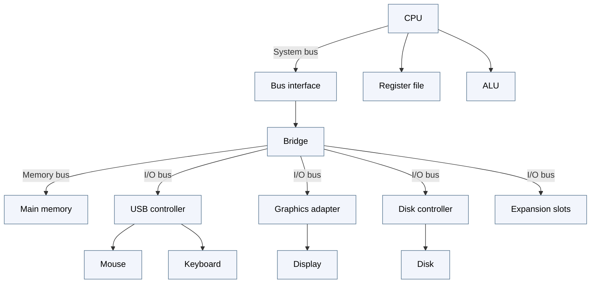

```mermaid
graph TD
    %% === Hardware Abstraction Diagram ===
    A[CPU] -->|System bus| B[Bus interface]
    A --> C[Register file]
    A --> D[ALU]
    B --> E[Bridge]
    E -->|Memory bus| F[Main memory]
    E -->|I/O bus| G[USB controller]
    E -->|I/O bus| H[Graphics adapter]
    E -->|I/O bus| I[Disk controller]
    E -->|I/O bus| J[Expansion slots ]

    %% USB Devices
    G --> M[Mouse]
    G --> N[Keyboard]
    H --> O[Display]
    I --> P[Disk]

    %% Styling
    classDef node fill:#f2f5fc,stroke:#577590,stroke-width:1px,color:#000;
    class A,B,C,D,E,F,G,H,I,J,M,N,O,P node;

```
