# Application Layer - Chapter 2 Revision Notes
## Kurose & Ross (8th Edition) | GATE CSE & Backend Java Prep

---

## 1. Principles of Network Applications

### 1.1 Application Architectures

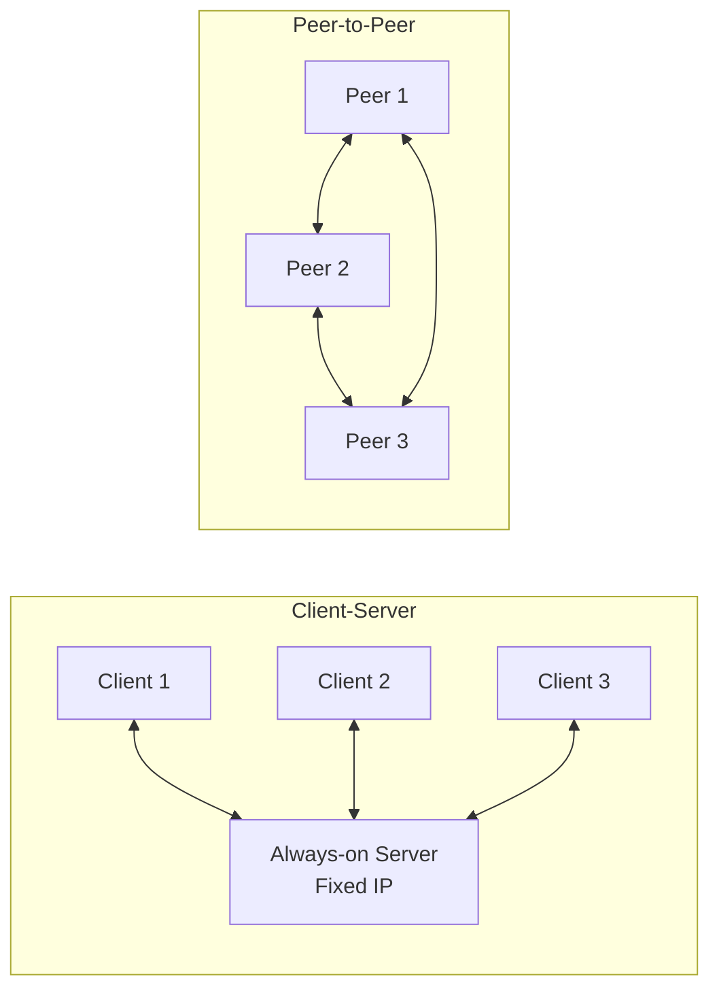

| Architecture | Characteristics | Examples |
|--------------|-----------------|----------|
| **Client-Server** | Always-on server, clients don't communicate directly, server has fixed IP | Web, Email, FTP |
| **P2P** | No always-on server, peers communicate directly, self-scalable | BitTorrent, Skype |

### 1.2 Processes & Sockets

**Process** = Program running on end system  
**Socket** = Interface between application and transport layer (door analogy)

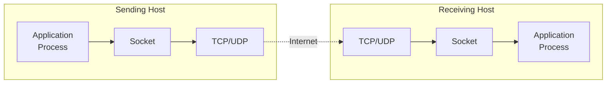

**Addressing:**
- **IP Address** (32-bit): Identifies host
- **Port Number**: Identifies process on host

| Service | Port Number |
|---------|-------------|
| HTTP | 80 |
| HTTPS | 443 |
| SMTP | 25 |
| DNS | 53 |
| FTP | 21 |

### 1.3 Transport Services

| Requirement | Description | Example Apps |
|-------------|-------------|--------------|
| **Reliable Data Transfer** | Guaranteed delivery, no loss | Email, file transfer, web |
| **Throughput** | Guaranteed minimum rate | Multimedia streaming |
| **Timing** | Low delay guarantees | Interactive games, VoIP |
| **Security** | Encryption, authentication | Banking, e-commerce |

### 1.4 TCP vs UDP Services

| Feature | TCP | UDP |
|---------|-----|-----|
| **Connection** | Connection-oriented (3-way handshake) | Connectionless |
| **Reliability** | Reliable (ordered, no loss) | Unreliable (may lose, reorder) |
| **Congestion Control** | Yes | No |
| **Speed** | Slower (overhead) | Faster (minimal overhead) |
| **Use Cases** | HTTP, FTP, SMTP, Telnet | DNS, SNMP, streaming, gaming |

**TLS (Transport Layer Security)**: TCP enhancement providing encryption, data integrity, authentication

---

## 2. HTTP (HyperText Transfer Protocol)

### 2.1 HTTP Basics

**Web Page** = Base HTML file + referenced objects (images, CSS, JS, etc.)  
**URL** = `http://hostname/path`  
**HTTP** = Stateless, uses TCP (port 80), application-layer protocol

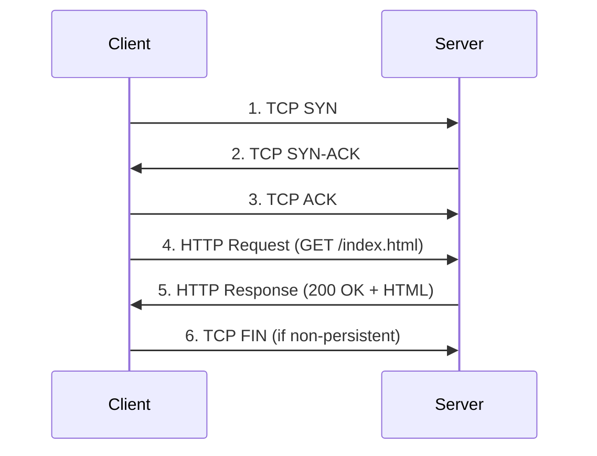

### 2.2 Persistent vs Non-Persistent Connections

| Type | Description | RTT Required | HTTP Version |
|------|-------------|--------------|--------------|
| **Non-Persistent** | One TCP connection per object | 2 RTT per object | HTTP/1.0 |
| **Persistent** | Multiple objects over same TCP | 1 RTT for 1st object, then pipelined | HTTP/1.1 (default) |

**RTT (Round-Trip Time)** = Time for small packet to go client → server → client

**Total Response Time (non-persistent)** = `2 RTT + file transmission time`

### 2.3 HTTP Message Format

#### HTTP Request

```
GET /index.html HTTP/1.1        ← Request line
Host: www.example.com            ← Header lines
Connection: close
User-agent: Mozilla/5.0
Accept-language: en
                                 ← Blank line
[Entity body]                    ← Optional (for POST)
```

**HTTP Methods:**

| Method | Purpose |
|--------|---------|
| **GET** | Request object (no entity body) |
| **POST** | Submit form data (entity body contains input) |
| **HEAD** | Like GET but no object returned (debugging) |
| **PUT** | Upload object to server |
| **DELETE** | Delete object from server |

#### HTTP Response

```
HTTP/1.1 200 OK                 ← Status line
Connection: close                ← Header lines
Date: Tue, 18 Aug 2015 15:44:04 GMT
Server: Apache/2.2.3
Last-Modified: Tue, 18 Aug 2015 15:11:03 GMT
Content-Length: 6821
Content-Type: text/html
                                 ← Blank line
<data data data...>              ← Entity body
```

**Common Status Codes:**

| Code | Phrase | Meaning |
|------|--------|---------|
| **200** | OK | Success |
| **301** | Moved Permanently | Resource moved (new URL in Location header) |
| **400** | Bad Request | Request not understood |
| **404** | Not Found | Document doesn't exist |
| **505** | HTTP Version Not Supported | Version not supported |

### 2.4 Cookies (User-Server State)

**Components:**
1. Cookie header in HTTP response
2. Cookie header in HTTP request  
3. Cookie file on user's system
4. Backend database at website

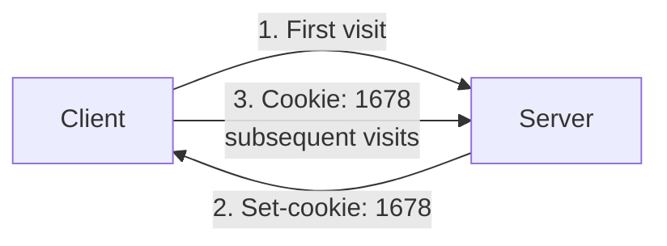

**Uses:** Shopping cart, personalization, tracking, session management

### 2.5 Web Caching (Proxy Server)

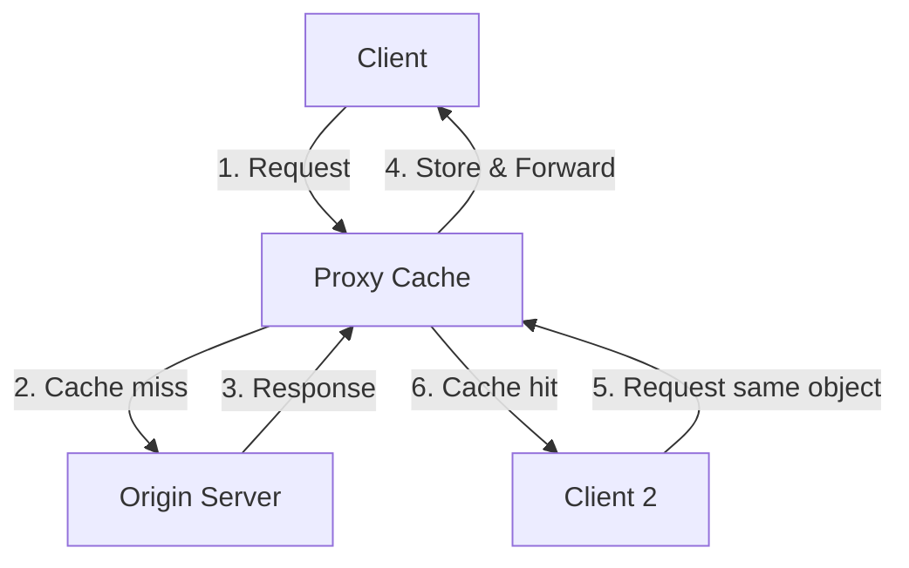

**Benefits:**
- Reduces response time (if cache hit)
- Reduces traffic on access link
- Reduces load on origin server

**Conditional GET:**
- Client includes `If-Modified-Since: <date>` header
- Server returns `304 Not Modified` if object unchanged (no entity body)
- Server returns `200 OK` with object if modified

### 2.6 HTTP/2

**Key Features:**
- **Multiplexing**: Multiple requests/responses over single TCP connection
- **Binary Framing**: More efficient than text-based HTTP/1.1
- **Server Push**: Server sends objects proactively
- **Header Compression**: Reduces overhead
- **Request Prioritization**: Weights for important requests

---

## 3. Email

### 3.1 Email System Components

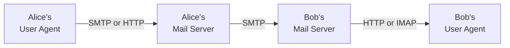

**Components:**
- **User Agents**: Outlook, Gmail, Apple Mail
- **Mail Servers**: Store mailboxes, run SMTP client/server
- **SMTP**: Push protocol for mail transfer

### 3.2 SMTP (Simple Mail Transfer Protocol)

**Port:** 25  
**Transport:** TCP  
**Characteristics:** Push protocol, 7-bit ASCII, persistent connections

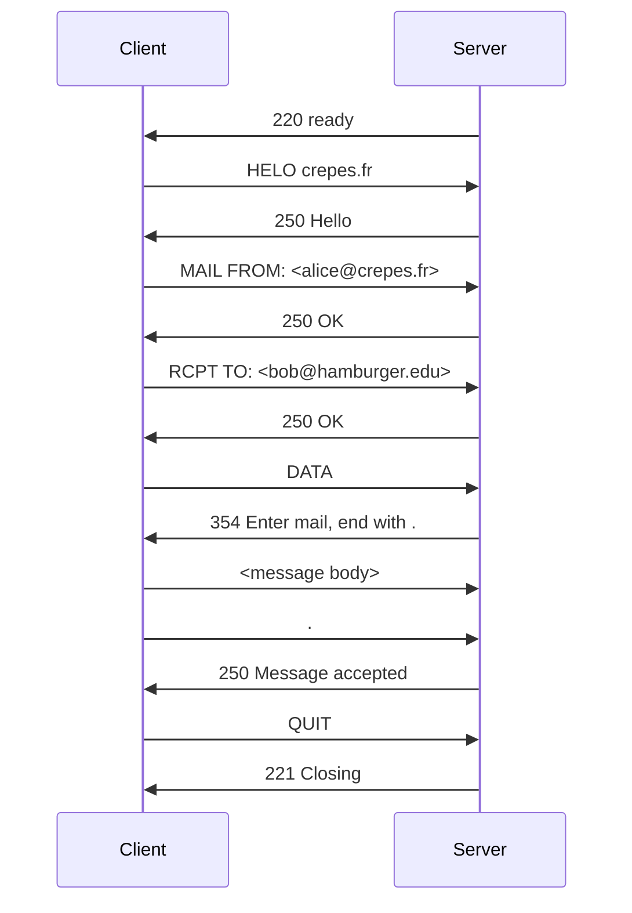

**SMTP Commands:** HELO, MAIL FROM, RCPT TO, DATA, QUIT

### 3.3 Mail Access Protocols

| Protocol | Purpose | Port |
|----------|---------|------|
| **SMTP** | Mail server to mail server (push) | 25 |
| **HTTP** | Webmail access (Gmail, Yahoo Mail) | 80/443 |
| **IMAP** | Mail client retrieval (Outlook) | 143 |

**Mail Message Format (RFC 5322):**
```
From: alice@crepes.fr
To: bob@hamburger.edu
Subject: Meeting

Hello Bob,
Let's meet at 3 PM.
```

---

## 4. DNS (Domain Name System)

### 4.1 DNS Services

**Primary Service:** Hostname → IP address translation  
**Additional Services:**
- Host aliasing (canonical vs alias names)
- Mail server aliasing (MX records)
- Load distribution (multiple IPs for one hostname)

### 4.2 DNS Hierarchy

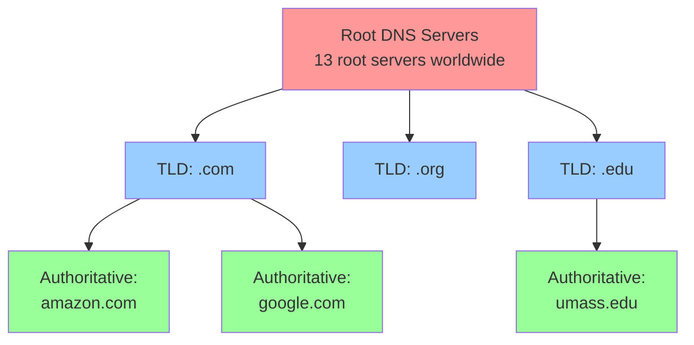

**DNS Server Types:**

| Type | Role |
|------|------|
| **Root** | Top of hierarchy, directs to TLD servers (13 root servers) |
| **TLD (Top-Level Domain)** | Handles .com, .org, .edu, etc. |
| **Authoritative** | Has actual hostname-IP mappings for organization |
| **Local** | ISP's DNS server, acts as proxy, caches responses |

### 4.3 DNS Query Process

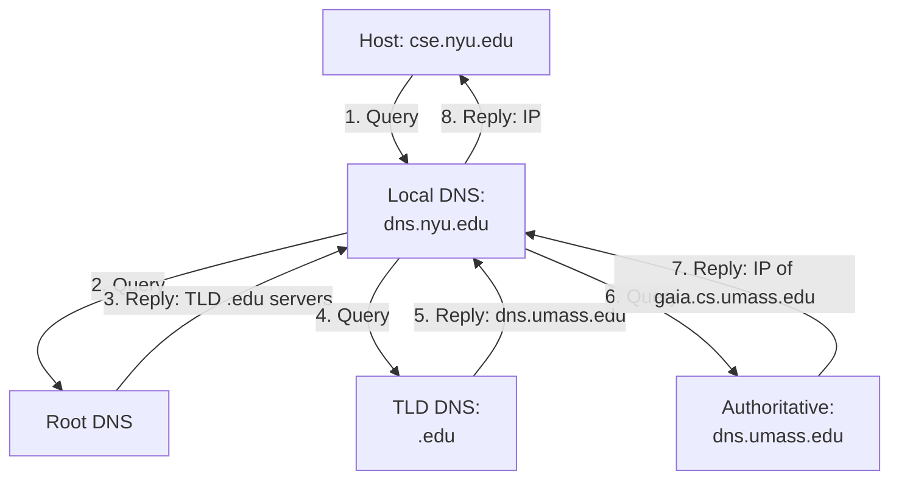

**Query Types:**
- **Iterative**: Each server returns next server to query
- **Recursive**: Server obtains answer on behalf of client

### 4.4 DNS Caching

- DNS servers cache responses (TTL-based)
- Reduces query traffic
- Local DNS typically caches TLD server addresses

### 4.5 DNS Resource Records (RR)

**Format:** `(Name, Value, Type, TTL)`

| Type | Name | Value | Example |
|------|------|-------|---------|
| **A** | Hostname | IP address | `(relay1.bar.foo.com, 145.37.93.126, A)` |
| **NS** | Domain | Authoritative DNS hostname | `(foo.com, dns.foo.com, NS)` |
| **CNAME** | Alias hostname | Canonical hostname | `(foo.com, relay1.bar.foo.com, CNAME)` |
| **MX** | Mail server alias | Canonical mail server name | `(foo.com, mail.bar.foo.com, MX)` |

### 4.6 DNS Messages

**Format:**
```
+------------------+
| Header           | ← Identification, flags, counts
+------------------+
| Question         | ← Name, type being queried
+------------------+
| Answer           | ← RRs answering query
+------------------+
| Authority        | ← RRs for authoritative servers
+------------------+
| Additional       | ← Additional helpful RRs
+------------------+
```

**Flags:**
- Query (0) or Reply (1)
- Authoritative answer
- Recursion desired/available

---

## 5. P2P File Distribution

### 5.1 Distribution Time Comparison

**Client-Server:**
```
D_cs = max(NF/u_s, F/d_min)
```
- Linear increase with N (number of peers)
- Server upload bandwidth bottleneck

**P2P:**
```
D_p2p = max(F/u_s, F/d_min, NF/(u_s + Σu_i))
```
- Self-scalable (peers contribute upload capacity)
- Sub-linear growth

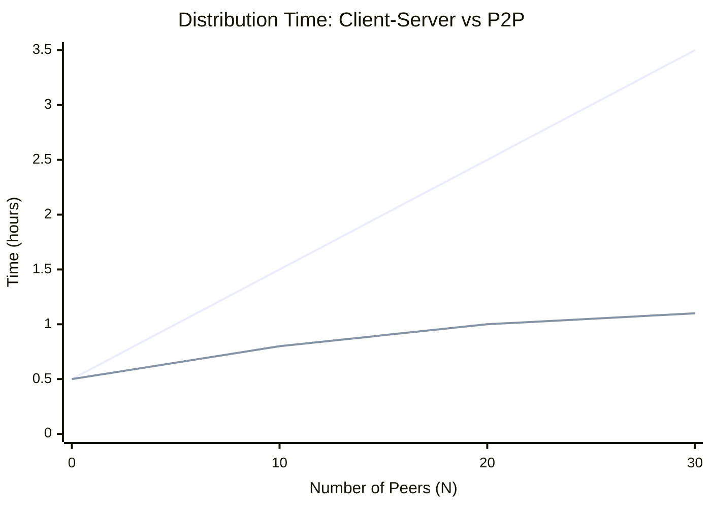

**Key:** P2P scales better as N increases

### 5.2 BitTorrent

**Terminology:**
- **Torrent**: Collection of peers exchanging chunks of file
- **Tracker**: Infrastructure node tracking peers in torrent
- **Chunk**: Fixed-size piece (256 KB typical)

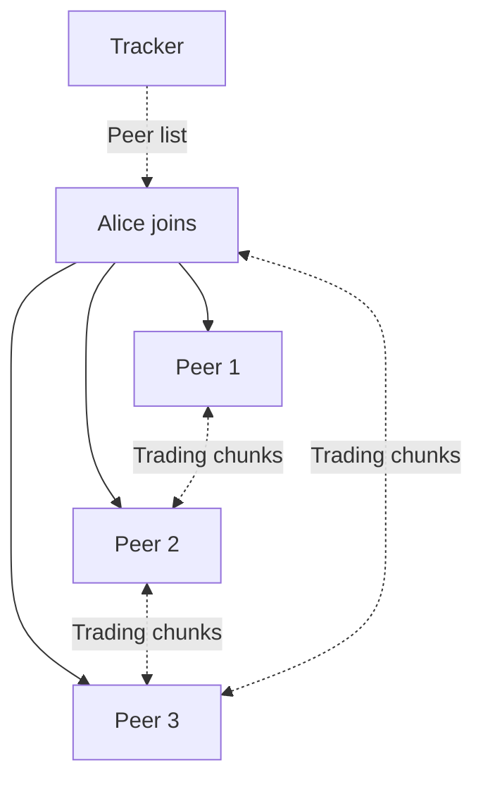

**Chunk Selection:**
- **Rarest First**: Request rarest chunks first (equalizes distribution)

**Peer Selection:**
- **Tit-for-tat**: Upload to peers who upload to you
- **Unchoke**: Top 4 uploaders + 1 random (optimistic unchoke)

---

## 6. Video Streaming & CDN

### 6.1 Video Characteristics

**Video** = Sequence of images (frames) at constant rate  
**Bit Rate** = Varies (compressed, multiple quality levels)  
**Challenge:** High bandwidth, heterogeneous clients

### 6.2 Streaming Types

| Type | Description |
|------|-------------|
| **UDP Streaming** | Constant rate, no congestion control (less common) |
| **HTTP Streaming** | Uses TCP, file stored at server |
| **DASH** | Dynamic Adaptive Streaming over HTTP |

### 6.3 DASH (Dynamic Adaptive Streaming over HTTP)

**Key Idea:** Server stores multiple versions of video at different bit rates, client dynamically selects chunks

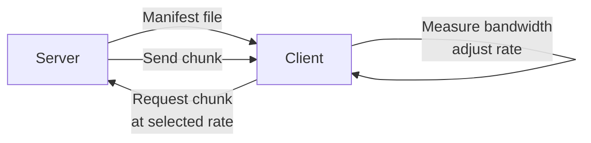

**Manifest File:** Lists URLs for different video rates/resolutions

**Client:**
- Measures available bandwidth
- Selects appropriate quality level
- Requests next chunk

### 6.4 CDN (Content Distribution Networks)

**Problem:** Single data center → long delays, congestion  
**Solution:** Distribute content across multiple geographically distributed servers

**CDN Strategies:**
- **Enter Deep**: Servers in access ISPs (Akamai)
- **Bring Home**: Fewer mega-servers at key locations

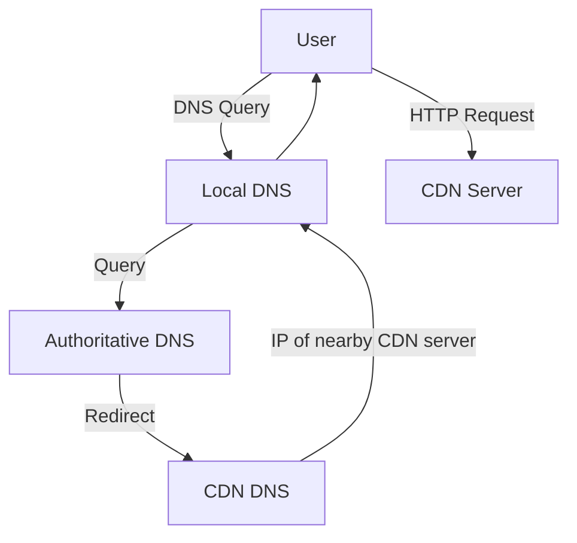

**Cluster Selection:**
- Geographic proximity
- Real-time measurements (delay, loss)
- Load balancing

---

## 7. Socket Programming

### 7.1 UDP Socket Programming

**Client:**
```python
from socket import *
serverName = 'hostname'
serverPort = 12000
clientSocket = socket(AF_INET, SOCK_DGRAM)
message = input('Input message: ')
clientSocket.sendto(message.encode(), (serverName, serverPort))
modifiedMessage, serverAddress = clientSocket.recvfrom(2048)
print(modifiedMessage.decode())
clientSocket.close()
```

**Server:**
```python
from socket import *
serverPort = 12000
serverSocket = socket(AF_INET, SOCK_DGRAM)
serverSocket.bind(('', serverPort))
print("Server ready")
while True:
    message, clientAddress = serverSocket.recvfrom(2048)
    modifiedMessage = message.decode().upper()
    serverSocket.sendto(modifiedMessage.encode(), clientAddress)
```

### 7.2 TCP Socket Programming

**Client:**
```python
from socket import *
serverName = 'hostname'
serverPort = 12000
clientSocket = socket(AF_INET, SOCK_STREAM)
clientSocket.connect((serverName, serverPort))
sentence = input('Input message: ')
clientSocket.send(sentence.encode())
modifiedSentence = clientSocket.recv(1024)
print(modifiedSentence.decode())
clientSocket.close()
```

**Server:**
```python
from socket import *
serverPort = 12000
serverSocket = socket(AF_INET, SOCK_STREAM)
serverSocket.bind(('', serverPort))
serverSocket.listen(1)
print("Server ready")
while True:
    connectionSocket, addr = serverSocket.accept()
    sentence = connectionSocket.recv(1024).decode()
    capitalizedSentence = sentence.upper()
    connectionSocket.send(capitalizedSentence.encode())
    connectionSocket.close()
```

**Key Differences:**

| Aspect | UDP | TCP |
|--------|-----|-----|
| **Socket Type** | SOCK_DGRAM | SOCK_STREAM |
| **Connection** | No connection setup | `connect()` & `accept()` |
| **Data Transfer** | `sendto()` / `recvfrom()` | `send()` / `recv()` |
| **Server Socket** | One socket for all clients | Welcome socket + connection sockets |

---

## 8. Quick Reference Tables

### 8.1 Application-Layer Protocols

| Application | Protocol | Transport | Port |
|-------------|----------|-----------|------|
| Web | HTTP/HTTPS | TCP | 80/443 |
| File Transfer | FTP | TCP | 21 |
| Email (transfer) | SMTP | TCP | 25 |
| Email (access) | IMAP | TCP | 143 |
| DNS | DNS | UDP | 53 |
| Streaming | DASH/HTTP | TCP | 80 |

### 8.2 HTTP Header Lines (Common)

| Header | Type | Purpose |
|--------|------|---------|
| **Host** | Request | Specifies server hostname |
| **Connection** | Request | close/keep-alive |
| **User-agent** | Request | Browser type |
| **Accept-language** | Request | Preferred language |
| **Cookie** | Request | Cookie data |
| **If-Modified-Since** | Request | Conditional GET |
| **Set-cookie** | Response | Create cookie |
| **Content-Type** | Response | MIME type (text/html, image/jpeg) |
| **Content-Length** | Response | Object size in bytes |
| **Last-Modified** | Response | When object was modified |

### 8.3 Important Formulas

| Formula | Description |
|---------|-------------|
| `RTT` | Round-Trip Time |
| `Response Time (non-persistent HTTP) = 2RTT + file transmission time` | Per object |
| `D_cs = max(NF/u_s, F/d_min)` | Client-server distribution time |
| `D_p2p = max(F/u_s, F/d_min, NF/(u_s + Σu_i))` | P2P distribution time |
| `Traffic Intensity = (request rate × object size) / link bandwidth` | Cache performance |

---

## 9. Key Concepts for GATE CSE

### Must Remember

1. **HTTP**: Stateless, persistent vs non-persistent, status codes, request/response format
2. **Cookies**: 4 components, how tracking works
3. **Web Caching**: Hit rate, conditional GET, traffic reduction
4. **SMTP**: Commands (HELO, MAIL FROM, RCPT TO, DATA, QUIT)
5. **DNS**: Hierarchy (Root, TLD, Authoritative, Local), RR types (A, NS, CNAME, MX)
6. **P2P**: Distribution time formulas, BitTorrent (rarest first, tit-for-tat)
7. **Socket Programming**: TCP vs UDP differences
8. **Port Numbers**: HTTP (80), HTTPS (443), SMTP (25), DNS (53)

### Common Exam Questions

- Calculate HTTP response time (RTT-based)
- DNS query resolution steps
- Compare P2P vs Client-Server distribution time
- Identify HTTP request/response components
- Explain web caching benefits
- Differentiate TCP vs UDP for applications
- DNS resource record interpretation

---

*Notes prepared for GATE CSE & Backend Java preparation | Based on Kurose & Ross Chapter 2*
