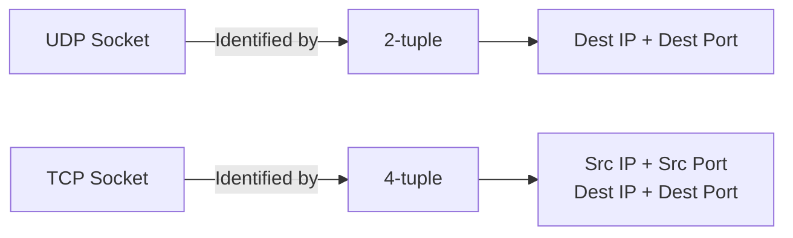
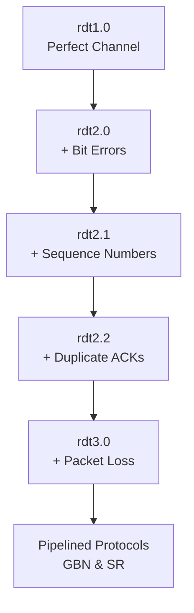
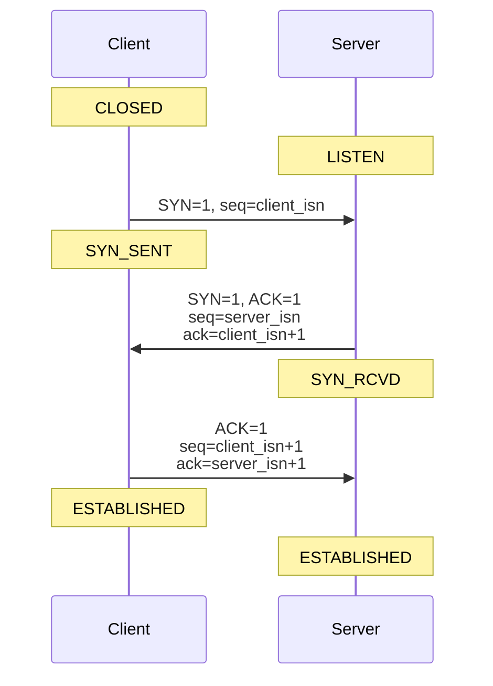
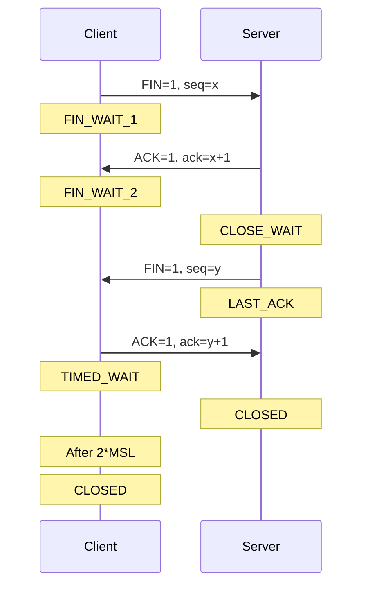
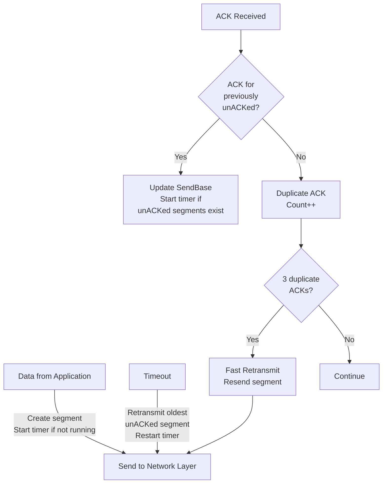
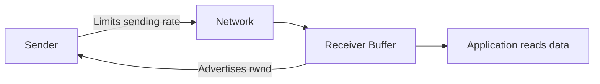
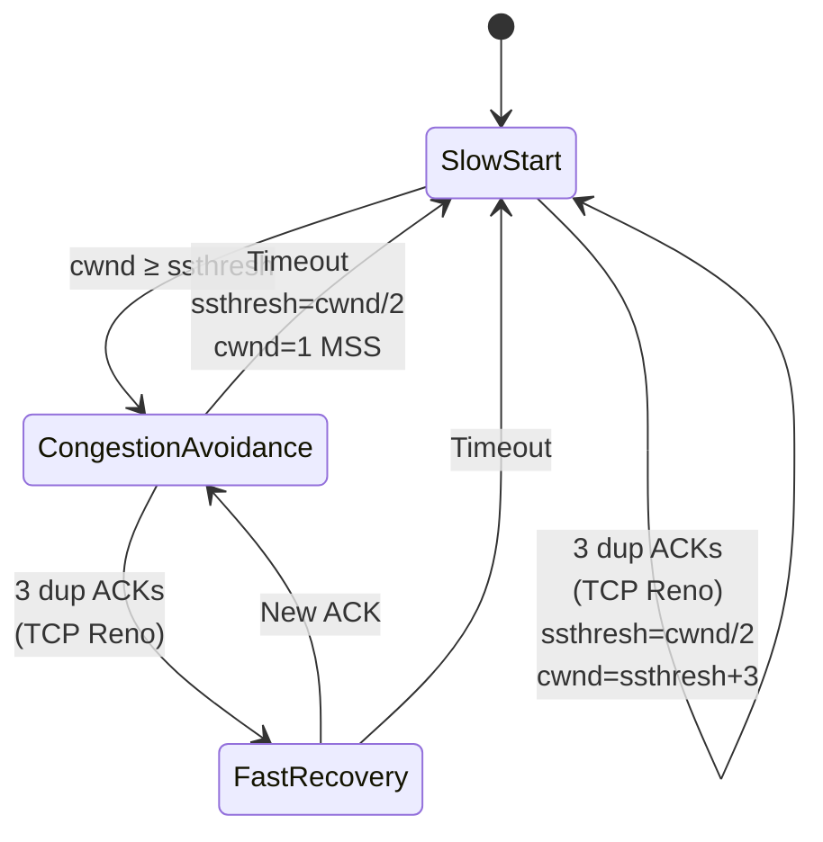
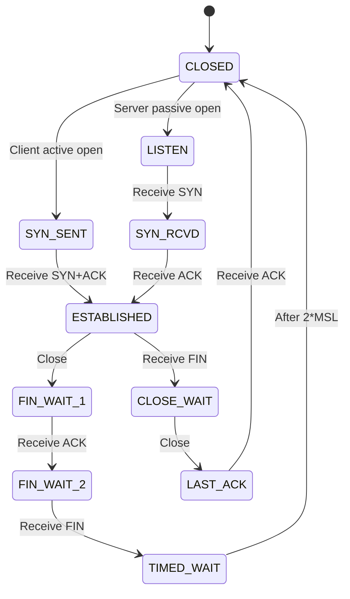

# Transport Layer (Chapter 3) - Revision Notes
*Computer Networking: A Top-Down Approach (Kurose & Ross)*

---

## 1. Transport Layer Overview

### Key Concepts
- **Logical Communication**: Process-to-process communication between applications on different hosts
- **Location**: Between Application and Network layers
- **Implementation**: Only in end systems, NOT in routers

### Transport vs Network Layer

| Aspect | Network Layer | Transport Layer |
|--------|--------------|-----------------|
| Communication | Host-to-host | Process-to-process |
| Scope | IP addresses | Port numbers + IP addresses |
| Reliability | Best effort (unreliable) | Can provide reliability (TCP) |

### Internet Transport Protocols

| Protocol | Type | Reliability | Connection | Use Cases |
|----------|------|-------------|------------|-----------|
| **UDP** | Connectionless | Unreliable | No | DNS, SNMP, Streaming, Gaming |
| **TCP** | Connection-oriented | Reliable | Yes | HTTP, FTP, SMTP, SSH |

---

## 2. Multiplexing & Demultiplexing

### Definition
- **Multiplexing** (Sender): Gather data from multiple sockets → add transport header → pass to network layer
- **Demultiplexing** (Receiver): Deliver received segments to correct socket

### Port Numbers
- **Range**: 0-65535 (16-bit field)
- **Well-known ports**: 0-1023 (HTTP=80, FTP=21, SSH=22, SMTP=25, DNS=53)
- **Dynamic ports**: 1024-65535

### Socket Identification



### UDP vs TCP Demultiplexing

**UDP**: Uses only destination IP + destination port
- Multiple clients → same server socket if dest IP:port match

**TCP**: Uses all 4 values (src IP, src port, dest IP, dest port)
- Each connection → unique socket
- Server creates new socket for each client connection

---

## 3. UDP (User Datagram Protocol)

### Characteristics
- ✗ No connection establishment (no handshaking)
- ✗ No reliability (no acknowledgments)
- ✗ No flow control
- ✗ No congestion control
- ✓ Fast (no delays)
- ✓ Simple (minimal overhead)
- ✓ Small header (8 bytes)

### UDP Segment Structure

```
 0                   16                  31
├────────────────────┼───────────────────┤
│   Source Port      │  Destination Port │
├────────────────────┼───────────────────┤
│      Length        │     Checksum      │
├────────────────────┴───────────────────┤
│                                         │
│          Application Data               │
│                                         │
└─────────────────────────────────────────┘
```

| Field | Size | Purpose |
|-------|------|---------|
| Source Port | 16 bits | Return address |
| Dest Port | 16 bits | Demultiplexing |
| Length | 16 bits | Header + Data (bytes) |
| Checksum | 16 bits | Error detection |

### UDP Checksum
- **Method**: 1's complement of sum of 16-bit words
- **Purpose**: Error detection (end-to-end principle)
- **Action on error**: Discard or pass to app with warning

### Why Use UDP?
1. **Finer control**: App controls when data is sent
2. **No connection delay**: No 3-way handshake
3. **No connection state**: More clients supported
4. **Less overhead**: 8 bytes vs 20 bytes (TCP)

---

## 4. Reliable Data Transfer (RDT) Principles

### RDT Evolution



### ARQ (Automatic Repeat reQuest) Mechanisms

| Mechanism | Purpose |
|-----------|---------|
| **Error Detection** | Checksum to detect bit errors |
| **Acknowledgments** | ACK (positive), NAK (negative) |
| **Retransmission** | Resend corrupted/lost packets |
| **Sequence Numbers** | Detect duplicates |
| **Timers** | Detect packet loss |

### Stop-and-Wait vs Pipelined

**Stop-and-Wait (rdt3.0)**
- Send 1 packet → wait for ACK → send next
- **Utilization**: Very low (U = L/R / (RTT + L/R))
- **Problem**: Poor performance on high-speed networks

**Pipelined Protocols**
- Send multiple packets without waiting
- **Benefits**: Higher utilization, better throughput
- **Requirements**: Larger sequence number range, buffering

---

## 5. Pipelined Protocols

### Go-Back-N (GBN)

**Sender:**
- Window size = N
- Can send N unacknowledged packets
- Timer for oldest unACKed packet
- On timeout: retransmit ALL unACKed packets

**Receiver:**
- Only sends cumulative ACKs
- Discards out-of-order packets
- Simple implementation

```
Sender Window:
[base ... nextseqnum-1 ... base+N-1]
 ↑                          ↑
 Sent not ACKed        Can send
```

### Selective Repeat (SR)

**Sender:**
- Window size = N
- Individual timers for each packet
- Retransmit only unACKed packets

**Receiver:**
- Buffers out-of-order packets
- Sends individual ACKs for each packet
- Delivers in-order to application

**Window Relationship**: N ≤ (sequence number space)/2

---

## 6. TCP (Transmission Control Protocol)

### TCP Characteristics
- ✓ Connection-oriented (3-way handshake)
- ✓ Reliable (in-order delivery)
- ✓ Flow control
- ✓ Congestion control
- ✓ Full-duplex (bidirectional)
- ✓ Point-to-point (1 sender, 1 receiver)

### TCP Segment Structure

```
 0                   16                  31
├────────────────────┼───────────────────┤
│   Source Port      │  Destination Port │
├────────────────────┼───────────────────┤
│          Sequence Number                │
├─────────────────────────────────────────┤
│       Acknowledgment Number              │
├────┬───┬───┬──────┼───────────────────┤
│Hlen│Res│Flg│Window│                     │
├────┴───┴───┴──────┤   Checksum         │
│                    │                     │
├────────────────────┼───────────────────┤
│  Urgent Pointer    │   Options         │
├────────────────────┴───────────────────┤
│                                         │
│             Data                        │
│                                         │
└─────────────────────────────────────────┘
```

### TCP Header Fields (20 bytes minimum)

| Field | Size | Purpose |
|-------|------|---------|
| Source/Dest Port | 16 bits each | Multiplexing |
| Sequence Number | 32 bits | Byte stream number of first data byte |
| ACK Number | 32 bits | Next expected byte number |
| Header Length | 4 bits | Header size in 32-bit words |
| Flags | 6 bits | URG, ACK, PSH, RST, SYN, FIN |
| Receive Window | 16 bits | Flow control (bytes willing to accept) |
| Checksum | 16 bits | Error detection |
| Urgent Pointer | 16 bits | End of urgent data |
| Options | Variable | MSS, timestamps, etc. |

### TCP Flags

| Flag | Name | Purpose |
|------|------|---------|
| **SYN** | Synchronize | Connection establishment |
| **ACK** | Acknowledge | Acknowledgment valid |
| **FIN** | Finish | Connection termination |
| **RST** | Reset | Abort connection |
| **PSH** | Push | Deliver data immediately |
| **URG** | Urgent | Urgent data pointer valid |

---

## 7. TCP Connection Management

### Three-Way Handshake (Connection Establishment)



**Steps:**
1. **Client → Server**: SYN segment (SYN=1, seq=client_isn)
2. **Server → Client**: SYNACK segment (SYN=1, ACK=1, seq=server_isn, ack=client_isn+1)
3. **Client → Server**: ACK segment (ACK=1, seq=client_isn+1, ack=server_isn+1)

### Connection Termination (Four-Way Handshake)



---

## 8. TCP Reliable Data Transfer

### Mechanisms
1. **Sequence numbers**: Byte-stream numbering
2. **Cumulative ACKs**: ACK number = next expected byte
3. **Retransmission timer**: Single timer for oldest unACKed segment
4. **Fast retransmit**: 3 duplicate ACKs → immediate retransmission

### TCP Sender Events



### Fast Retransmit
- Receive 3 duplicate ACKs → retransmit immediately
- Don't wait for timeout
- Improves performance

---

## 9. TCP Flow Control

### Purpose
Prevent sender from overwhelming receiver's buffer

### Mechanism
- **Receive Window (rwnd)**: Free buffer space at receiver
- Receiver advertises rwnd in every segment
- Sender limits unACKed data to rwnd

```
LastByteSent - LastByteAcked ≤ rwnd
```

### Flow Control Illustration



**Formula at Receiver:**
```
rwnd = RcvBuffer - [LastByteRcvd - LastByteRead]
```

### Zero Window Problem
- If rwnd = 0, sender stops sending data
- **Solution**: Sender sends 1-byte probe segments periodically

---

## 10. TCP Round-Trip Time & Timeout

### RTT Estimation

**Sample RTT (SampleRTT)**
- Measured for one segment at a time
- Time from send to ACK received
- NOT measured for retransmitted segments

**Estimated RTT (EstimatedRTT)**
- Exponential Weighted Moving Average (EWMA)
- Formula: `EstimatedRTT = (1-α) × EstimatedRTT + α × SampleRTT`
- Recommended: α = 0.125 (1/8)

**RTT Deviation (DevRTT)**
- Measures variability
- Formula: `DevRTT = (1-β) × DevRTT + β × |SampleRTT - EstimatedRTT|`
- Recommended: β = 0.25 (1/4)

### Timeout Interval

```
TimeoutInterval = EstimatedRTT + 4 × DevRTT
```

**Initial value**: 1 second
**After timeout**: Double the timeout (exponential backoff)

---

## 11. TCP Congestion Control

### Congestion Signals
- **Loss event**: Timeout or 3 duplicate ACKs
- Indicates network congestion

### Congestion Window (cwnd)
- Limits sending rate: `LastByteSent - LastByteAcked ≤ min{cwnd, rwnd}`
- Sending rate ≈ cwnd / RTT bytes/sec

### TCP Congestion Control Algorithms



### 1. Slow Start
- **Initial**: cwnd = 1 MSS
- **Growth**: cwnd doubles every RTT (exponential)
- **Increment**: cwnd += 1 MSS for each ACK
- **End**: When cwnd ≥ ssthresh OR loss detected

### 2. Congestion Avoidance (AIMD)
- **Growth**: cwnd increases by 1 MSS per RTT (linear)
- **Increment**: cwnd += MSS × (MSS/cwnd) for each ACK
- **On loss**: ssthresh = cwnd/2

### 3. Fast Recovery (TCP Reno)
- **Trigger**: 3 duplicate ACKs
- **Action**: 
  - ssthresh = cwnd/2
  - cwnd = ssthresh + 3 MSS
  - Retransmit missing segment
  - Inflate cwnd by 1 MSS for each dup ACK
  - On new ACK: cwnd = ssthresh (exit to CA)

### TCP Variants Comparison

| Variant | Slow Start | Congestion Avoidance | Fast Retransmit | Fast Recovery |
|---------|-----------|---------------------|----------------|---------------|
| **TCP Tahoe** | ✓ | ✓ | ✓ | ✗ |
| **TCP Reno** | ✓ | ✓ | ✓ | ✓ |
| **TCP NewReno** | ✓ | ✓ | ✓ | ✓ (improved) |
| **TCP CUBIC** | ✓ | ✓ (cubic) | ✓ | ✓ |

### AIMD (Additive Increase Multiplicative Decrease)
- **Additive Increase**: cwnd += 1 MSS per RTT
- **Multiplicative Decrease**: cwnd = cwnd/2 on loss
- **Result**: Sawtooth pattern, fairness among flows

---

## 12. TCP Fairness

### Goal
Multiple TCP connections sharing a link should get equal bandwidth

### Mechanism
AIMD converges to fair allocation

```
Bandwidth for connection 1 ≈ Bandwidth for connection 2
(for same RTT and MSS)
```

### Fairness Issues
- **Different RTTs**: Smaller RTT → faster increase → more bandwidth
- **Parallel connections**: Multiple connections → more total bandwidth
- **UDP traffic**: No congestion control → can starve TCP flows

---

## 13. Important Formulas

### Performance

| Metric | Formula |
|--------|---------|
| **Utilization (Stop-and-Wait)** | U = (L/R) / (RTT + L/R) |
| **Throughput** | Throughput ≈ cwnd / RTT |
| **TCP Throughput** | Avg = (1.22 × MSS) / (RTT × √L) |

Where:
- L = packet size (bits)
- R = link bandwidth (bps)
- RTT = round-trip time
- L = loss rate

### Window Calculations

```
Effective Window = min{cwnd, rwnd}
Sending Rate ≤ Effective Window / RTT
```

---

## 14. Key Differences Summary

### UDP vs TCP

| Feature | UDP | TCP |
|---------|-----|-----|
| Connection | Connectionless | Connection-oriented |
| Reliability | Best effort | Guaranteed delivery |
| Ordering | No | In-order delivery |
| Flow Control | No | Yes (rwnd) |
| Congestion Control | No | Yes (cwnd) |
| Header Size | 8 bytes | 20+ bytes |
| Speed | Faster | Slower |
| Use Case | Real-time apps | Reliable transfer |

### GBN vs Selective Repeat

| Aspect | Go-Back-N | Selective Repeat |
|--------|-----------|------------------|
| Receiver Buffer | No buffering | Buffers out-of-order |
| Retransmission | All unACKed | Only lost packets |
| ACKs | Cumulative | Individual |
| Complexity | Simple | Complex |
| Window Constraint | N < seq space | N ≤ seq space/2 |

---

## 15. Common TCP States



---

## 16. Practice Questions for GATE

### Quick Recall
1. What is the maximum window size for SR if sequence numbers are n bits?
   - **Answer**: 2^(n-1)

2. TCP uses which acknowledgment scheme?
   - **Answer**: Cumulative acknowledgments

3. What happens on 3 duplicate ACKs in TCP Reno?
   - **Answer**: Fast retransmit + Fast recovery

4. Minimum TCP header size?
   - **Answer**: 20 bytes

5. UDP header size?
   - **Answer**: 8 bytes

6. Port number size?
   - **Answer**: 16 bits (0-65535)

7. MSL in TCP?
   - **Answer**: Maximum Segment Lifetime (typically 2 minutes)

8. Initial cwnd in TCP?
   - **Answer**: 1 MSS (or up to 10 MSS in modern implementations)

### Numerical Problem Types
1. Calculate utilization of stop-and-wait
2. Calculate TCP throughput
3. Calculate timeout interval
4. Window size calculations
5. Sequence/ACK number problems

---

## 17. Important Points for Backend Java

### Socket Programming Relevance
- **ServerSocket**: TCP server-side (creates welcoming socket)
- **Socket**: TCP connection socket (one per client)
- **DatagramSocket**: UDP socket
- **Port binding**: Understanding well-known vs ephemeral ports
- **Connection pooling**: TCP connection reuse
- **HTTP/1.1**: Persistent TCP connections
- **HTTP/2**: Single TCP connection, multiplexing
- **HTTP/3 (QUIC)**: UDP-based with reliability at application layer

### Performance Considerations
- **TCP overhead**: 3-way handshake delay
- **Head-of-line blocking**: TCP ensures ordering
- **Buffering**: Socket send/receive buffers
- **Nagle's algorithm**: Combines small packets
- **TCP_NODELAY**: Disable Nagle's for low latency

---

## 18. Mnemonic Devices

### TCP Flags (UAPRSF)
**U**rgent **A**cknowledge **P**ush **R**eset **S**ynchronize **F**inish

### TCP State Transitions
**CLOSED → LISTEN → SYN_RCVD → ESTABLISHED → FIN_WAIT → TIMED_WAIT → CLOSED**

### ARQ Requirements
**FEAR**: **F**eedback, **E**rror detection, **A**cknowledgments, **R**etransmission

---

## Quick Revision Checklist

- [ ] Multiplexing/Demultiplexing (UDP 2-tuple, TCP 4-tuple)
- [ ] UDP segment structure (4 fields)
- [ ] TCP segment structure (20 bytes minimum)
- [ ] 3-way handshake (SYN → SYNACK → ACK)
- [ ] 4-way termination (FIN → ACK → FIN → ACK)
- [ ] Sequence and ACK numbers (byte-stream based)
- [ ] RTT estimation (EWMA formula)
- [ ] Timeout calculation (EstimatedRTT + 4×DevRTT)
- [ ] Fast retransmit (3 duplicate ACKs)
- [ ] Flow control (rwnd mechanism)
- [ ] Congestion control (Slow Start, CA, Fast Recovery)
- [ ] AIMD principle
- [ ] GBN vs SR differences
- [ ] TCP fairness
- [ ] Stop-and-wait vs pipelining

---

**End of Notes**

*Created for GATE CSE & Backend Java Learning*
*Based on Kurose & Ross, 8th Edition, Chapter 3*
