# Computer Networks and the Internet - Chapter 1 Revision Notes
## Kurose & Ross (8th Edition) | GATE CSE & Backend Java Prep

---

## 1. What is the Internet?

### 1.1 Nuts-and-Bolts View


| Component | Description |
|-----------|-------------|
| **End Systems (Hosts)** | Devices at network edge (PCs, servers, smartphones, IoT) |
| **Packet Switches** | Routers (network core) & Link-layer switches (access networks) |
| **Communication Links** | Physical media connecting devices (fiber, copper, wireless) |
| **ISPs** | Internet Service Providers - networks of switches & links |
| **Protocols** | Rules governing data transmission (TCP, IP, HTTP, SMTP) |

### 1.2 Services View
- Internet = Infrastructure providing services to distributed applications
- **Socket Interface**: API for programs to send/receive data

### 1.3 Protocol Definition
> **Protocol** = Defines format & order of messages exchanged + actions taken on transmission/receipt


---

## 2. Network Edge

### 2.1 End Systems Classification


### 2.2 Access Networks

| Type | Technology | Speed | Medium |
|------|------------|-------|--------|
| **DSL** | Uses telephone line | Up to 52 Mbps down, 16 Mbps up | Twisted pair |
| **Cable (HFC)** | Uses TV cable | Up to 1.2 Gbps down, 100 Mbps up | Fiber + Coaxial |
| **FTTH** | Fiber to Home (PON/AON) | Gbps range | Fiber optics |
| **Ethernet** | Enterprise/Home LAN | 100 Mbps - 10 Gbps | Twisted pair |
| **WiFi (802.11)** | Wireless LAN | 100+ Mbps | Radio |
| **4G/5G** | Cellular | 60 Mbps (4G), higher (5G) | Radio |


### 2.3 Physical Media

| Media Type | Category | Characteristics |
|------------|----------|-----------------|
| **Twisted Pair (UTP)** | Guided | Cheapest, 10 Mbps - 10 Gbps, used in LANs & DSL |
| **Coaxial Cable** | Guided | Higher bandwidth, used in Cable TV/Internet |
| **Fiber Optics** | Guided | Highest speed (100s Gbps), immune to interference, long-haul |
| **Radio (Terrestrial)** | Unguided | No wires, penetrates walls, subject to interference |
| **Satellite** | Unguided | Geostationary (280ms delay) or LEO |

---

## 3. Network Core

### 3.1 Packet Switching


**Key Concepts:**
- **Store-and-Forward**: Router receives entire packet before forwarding
- **End-to-End Delay** (N links, L bits, R bps): `d = N × (L/R)`
- **Queuing**: Packets wait in output buffer if link busy
- **Packet Loss**: Occurs when buffer overflows

**Forwarding Table**: Maps destination IP → outbound link (set by routing protocols)

### 3.2 Circuit Switching

| Aspect | Packet Switching | Circuit Switching |
|--------|------------------|-------------------|
| **Resource Allocation** | On-demand | Reserved for session |
| **Delay** | Variable (queuing) | Constant (guaranteed) |
| **Efficiency** | High (statistical multiplexing) | Low (idle periods wasted) |
| **Example** | Internet | Traditional telephone |

**Multiplexing in Circuit Switching:**


### 3.3 Network of Networks (ISP Hierarchy)


| Term | Definition |
|------|------------|
| **Tier-1 ISP** | Global coverage, peers with all other Tier-1s (AT&T, Sprint) |
| **Regional ISP** | Connects access ISPs to Tier-1 |
| **Access ISP** | Directly connects end users |
| **IXP** | Internet Exchange Point - ISPs peer here |
| **PoP** | Point of Presence - router group for ISP connection |
| **Multi-homing** | Connecting to multiple provider ISPs |
| **Peering** | Direct connection between ISPs (usually settlement-free) |

---

## 4. Delay, Loss, and Throughput

### 4.1 Types of Delay


| Delay Type | Formula | Description | Typical Value |
|------------|---------|-------------|---------------|
| **Processing (d_proc)** | - | Header check, routing lookup | μs |
| **Queuing (d_queue)** | Variable | Wait in output buffer | μs to ms |
| **Transmission (d_trans)** | L/R | Push bits onto link | μs to ms |
| **Propagation (d_prop)** | d/s | Bit travel time | ms (WAN) |

**Total Nodal Delay:**
```
d_nodal = d_proc + d_queue + d_trans + d_prop
```

**End-to-End Delay (N hops):**
```
d_end-to-end = N × (d_proc + d_trans + d_prop)
```

### 4.2 Traffic Intensity & Queuing

```
Traffic Intensity = La/R
```
Where: L = packet size (bits), a = arrival rate (packets/sec), R = transmission rate (bps)

| Traffic Intensity | Queue Behavior |
|-------------------|----------------|
| La/R ≈ 0 | Small queuing delay |
| La/R → 1 | Large queuing delay |
| La/R > 1 | Queue grows unbounded → Packet Loss |

### 4.3 Throughput


**Throughput = min(R₁, R₂, ..., Rₙ)** (Bottleneck link)

- **Instantaneous Throughput**: Rate at any instant
- **Average Throughput**: F/T (F = file size, T = transfer time)

---

## 5. Protocol Layers

### 5.1 Internet Protocol Stack (5 Layers)


| Layer | PDU | Function | Protocols |
|-------|-----|----------|-----------|
| **Application** | Message | Network apps & protocols | HTTP, SMTP, FTP, DNS |
| **Transport** | Segment | End-to-end data transfer | TCP (reliable), UDP (unreliable) |
| **Network** | Datagram | Routing packets source→dest | IP, Routing protocols |
| **Link** | Frame | Node-to-node transfer | Ethernet, WiFi, PPP |
| **Physical** | Bits | Bit transmission on medium | Depends on media |

### 5.2 OSI Model (7 Layers)
OSI adds **Presentation** (encryption, compression) and **Session** (checkpointing) between Application and Transport.

### 5.3 Encapsulation

```mermaid
flowchart TD
    M[Message M] --> Seg[Segment: Ht + M]
    Seg --> Dgram[Datagram: Hn + Ht + M]
    Dgram --> Frame[Frame: Hl + Hn + Ht + M]
```



| Device | Layers Implemented |
|--------|-------------------|
| **Host** | All 5 layers |
| **Router** | Physical, Link, Network |
| **Link-layer Switch** | Physical, Link |

---

## 6. Network Security

### 6.1 Types of Attacks


| Attack Type | Description |
|-------------|-------------|
| **Virus** | Malware requiring user interaction to infect |
| **Worm** | Self-replicating malware |
| **DoS** | Overwhelm target with traffic |
| **DDoS** | Distributed DoS using botnets |
| **Packet Sniffing** | Capturing packets on shared medium |
| **IP Spoofing** | Sending packets with fake source address |

---

## 7. Quick Formulas Reference

| Formula | Description |
|---------|-------------|
| `d_trans = L/R` | Transmission delay |
| `d_prop = d/s` | Propagation delay (d=distance, s=speed) |
| `d_end-to-end = N(L/R)` | End-to-end delay (N links, ignoring prop) |
| `Traffic Intensity = La/R` | Queue behavior indicator |
| `Throughput = min(R₁, R₂, ..., Rₙ)` | Bottleneck determines throughput |
| `TDM rate = Frame_rate × Bits_per_slot` | Circuit rate in TDM |

---

## 8. Key Differences Table

| Concept A | Concept B | Key Difference |
|-----------|-----------|----------------|
| Transmission Delay | Propagation Delay | Trans = push bits; Prop = bit travel time |
| Router | Switch | Router: Layer 3 (IP); Switch: Layer 2 (MAC) |
| TCP | UDP | TCP: reliable, connection; UDP: unreliable, connectionless |
| FDM | TDM | FDM: frequency bands; TDM: time slots |
| Guided Media | Unguided Media | Guided: solid medium; Unguided: air/space |

---

## 9. Important Standards & Organizations

| Organization | Role |
|--------------|------|
| **IETF** | Internet standards (RFCs) |
| **IEEE 802** | LAN standards (Ethernet, WiFi) |

---

*Notes prepared for GATE CSE & Backend Java preparation | Based on Kurose & Ross Chapter 1*
