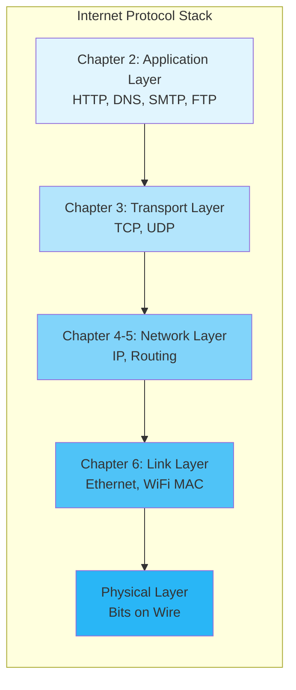
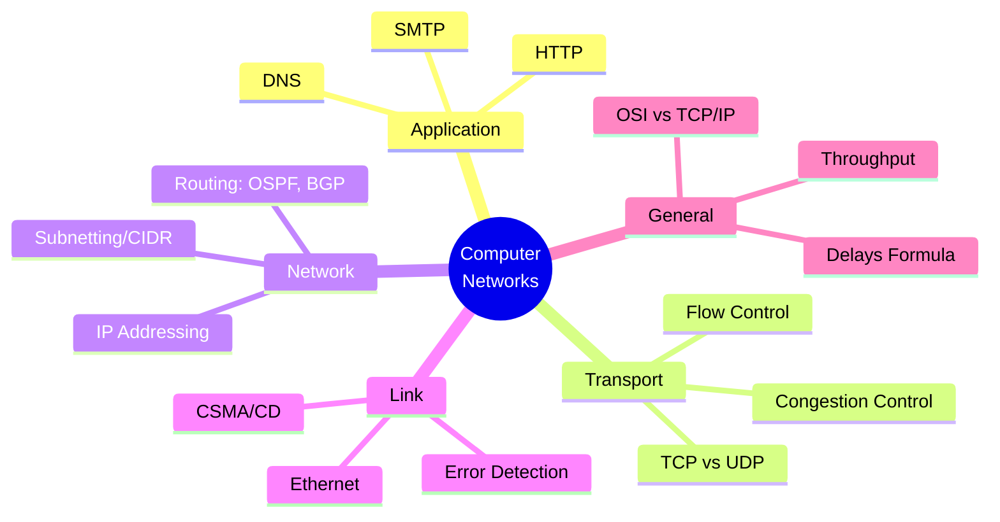

# Computer Networking: A Top-Down Approach (8th Edition)
##  Complete Study Notes | Kurose & Ross

---

## 📑 Table of Contents

| Chapter | Title | Topics Covered | 
|:-------:|-------|----------------|
| 1 | [Computer Networks and the Internet](./Chapter-01/CN_Chapter1_Notes.md) | Internet overview, Network edge & core, Delay/Loss/Throughput, Protocol layers, Security basics | 
| 2 | [Application Layer](./Chapter-02/CN_Chapter2_Notes.md) | HTTP, FTP, SMTP, DNS, P2P, Socket Programming | 
| 3 | [Transport Layer](./Chapter-03/CN_Chapter3_Notes.md) | UDP, TCP, Reliable data transfer, Congestion control | 
| 4 | [Network Layer: Data Plane](./Chapter-04/CN_Chapter4_Notes.md) | Router architecture, IPv4, IPv6, NAT, DHCP | 
| 5 | [Network Layer: Control Plane](./Chapter-05/CN_Chapter5_Notes.md) | Routing algorithms, OSPF, BGP, SDN, ICMP | 
| 6 | [Link Layer and LANs](./Chapter-06/CN_Chapter6_Notes.md) | Error detection, MAC protocols, Ethernet, Switches, VLANs | 
| 7 | [Wireless and Mobile Networks](./Chapter-07/CN_Chapter7_Notes.md) | WiFi (802.11), Cellular (4G/5G), Mobility management | 
| 8 | [Security in Computer Networks](./Chapter-08/CN_Chapter8_Notes.md) | Cryptography, Authentication, SSL/TLS, Firewalls, IPsec | 

---

## 🗺️ Network Layers Overview

---

## 📊 Chapter-wise Key Concepts

### Chapter 1: Computer Networks and the Internet
- Internet components: Hosts, Routers, Links, ISPs
- Packet vs Circuit Switching
- Delay types: Processing, Queuing, Transmission, Propagation
- Protocol layering (5-layer model)

### Chapter 2: Application Layer
- Client-server vs P2P architecture
- HTTP (persistent/non-persistent), Cookies, Web caching
- DNS hierarchy and records
- Socket programming (TCP/UDP)

### Chapter 3: Transport Layer
- Multiplexing/Demultiplexing
- UDP: Connectionless, checksum
- Reliable Data Transfer (rdt) protocols
- TCP: Connection management, flow control, congestion control

### Chapter 4: Network Layer - Data Plane
- Router architecture (input/output ports, switching fabric)
- IPv4 addressing, subnetting, CIDR
- NAT, DHCP
- IPv6 features and transition

### Chapter 5: Network Layer - Control Plane
- Link-state (Dijkstra) vs Distance-vector (Bellman-Ford)
- OSPF (intra-AS) and BGP (inter-AS)
- SDN concepts
- ICMP

### Chapter 6: Link Layer and LANs
- Error detection: CRC, Checksum
- Multiple access: CSMA/CD, CSMA/CA
- MAC addressing, ARP
- Ethernet, Switches, VLANs

### Chapter 7: Wireless and Mobile Networks
- 802.11 (WiFi) architecture and protocols
- Cellular networks: 4G LTE, 5G
- Mobility: Handoff, Mobile IP

### Chapter 8: Security
- Symmetric vs Asymmetric encryption
- Message integrity: MAC, Digital signatures
- SSL/TLS, IPsec
- Firewalls and IDS

---

## 🎯 GATE CSE Important Topics

---

## 🔗 Useful Resources

- 📖 [Official Book Website](https://gaia.cs.umass.edu/kurose_ross/index.php)
- 🎥 [Authors' Video Lectures](https://gaia.cs.umass.edu/kurose_ross/lectures.php)
- 💻 [Wireshark Labs](https://gaia.cs.umass.edu/kurose_ross/wireshark.php)
- 📝 [Interactive Problems](https://gaia.cs.umass.edu/kurose_ross/interactive/)

---
