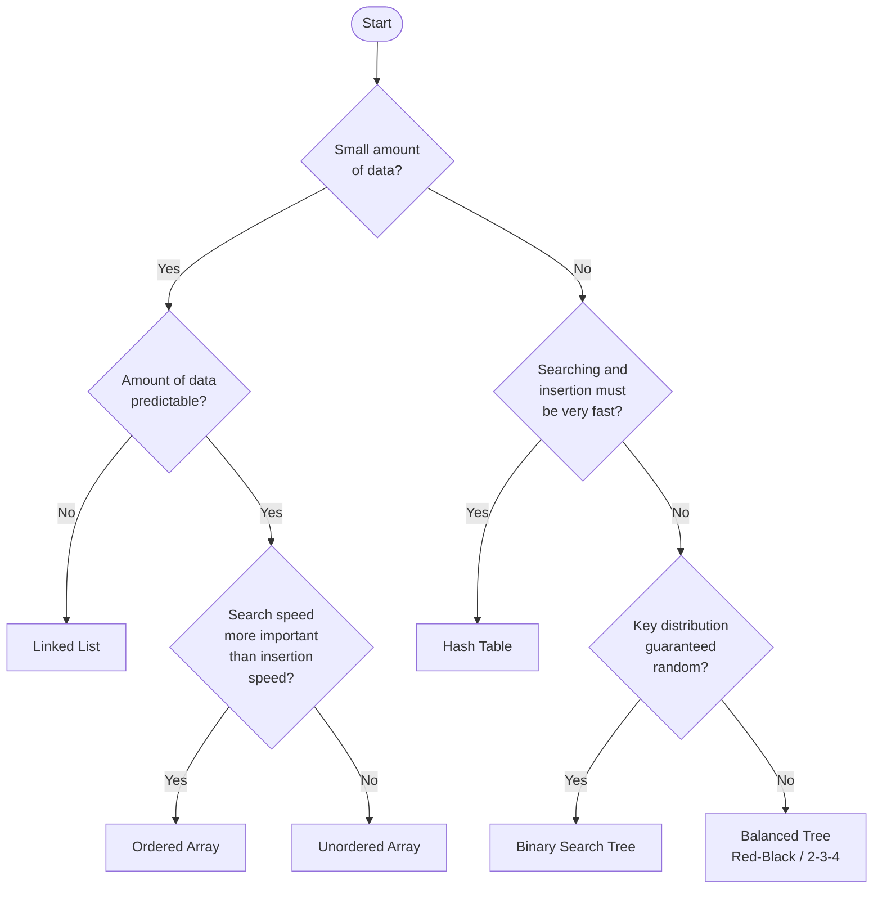

# 📊 Complete Summary of 32 Data Structure Files

---

###  Decision Path Explanation

| Decision Point | Recommendation | Why? |
|----------------|----------------|------|
| **Small + Unpredictable size** | **Linked List** | Dynamic sizing, no wasted space |
| **Small + Predictable + Search priority** | **Ordered Array** | Binary search O(log n), space efficient |
| **Small + Predictable + Insert priority** | **Unordered Array** | Fast O(1) insertion at end |
| **Large + Very fast operations needed** | **Hash Table** | O(1) average search/insert |
| **Large + Random keys** | **Binary Search Tree** | O(log n) if balanced naturally |
| **Large + Non-random keys** | **Balanced Tree** | Guaranteed O(log n) operations |

###  Key Considerations

- **Small data** (< 100 elements): Arrays or simple lists work well
- **Large data** (> 1000 elements): Consider hash tables or balanced trees
- **Predictable size**: Arrays are memory-efficient
- **Unpredictable size**: Use dynamic structures (linked lists, trees)
- **Search-heavy**: Ordered arrays, BSTs, or hash tables
- **Insert-heavy**: Unordered arrays, linked lists, or hash tables
- **Guaranteed performance**: Balanced trees (Red-Black, 2-3-4)
  
---
## 📊 Data Structure Performance Comparison

### General-Purpose Data Storage Structures

| Data Structure | Search | Insertion | Deletion | Traversal |
|----------------|--------|-----------|----------|-----------|
| **Array** | O(N) | O(1) | O(N) | — |
| **Ordered array** | O(log N) | O(N) | O(N) | O(N) |
| **Linked list** | O(N) | O(1) | O(N) | — |
| **Ordered linked list** | O(N) | O(N) | O(N) | O(N) |
| **Binary tree** (average) | O(log N) | O(log N) | O(log N) | O(N) |
| **Binary tree** (worst case) | O(N) | O(N) | O(N) | O(N) |
| **Balanced tree** (average and worst case) | O(log N) | O(log N) | O(log N) | O(N) |
| **Hash table** | O(1) | O(1) | O(1) | — |

### Special-Purpose Data Storage Structures

| Data Structure | Insertion | Deletion | Comment |
|----------------|-----------|----------|---------|
| **Stack** (array or linked list) | O(1) | O(1) | Deletes most recently inserted item |
| **Queue** (array or linked list) | O(1) | O(1) | Deletes least recently inserted item |
| **Priority queue** (ordered array) | O(N) | O(1) | Deletes highest-priority item |
| **Priority queue** (heap) | O(log N) | O(log N) | Deletes highest-priority item |

### When to Use
| Data Structure | Use Case                |
|-----------|--------------------------------------------------------------------------|
| **Array** | Image processing, game boards, buffer management, fixed-size data storage |
| **Ordered Array** | Phone directories, dictionary lookups, static sorted data, binary search requirements |
| **Linked List** | Music playlists, browser history, undo/redo operations, dynamic memory allocation |
| **Ordered Linked List** | Sorted event logs, maintaining insertion-order sorted data, merge operations |
| **Binary Tree** | File systems, expression parsing, database indexing, autocomplete features |
| **Balanced Tree** | Java TreeMap, C++ std::map, guaranteed O(log n) operations, worst-case performance matters |
| **Hash Table** | Caching systems, symbol tables, password storage, duplicate detection, constant-time lookups |
| **Stack** | Function calls, undo/redo, expression evaluation, backtracking, DFS algorithm |
| **Queue** | Task scheduling, BFS traversal, buffering, print job management, message queues |
| **Priority Queue (Array)** | Small datasets where removals are frequent, simple event scheduling |
| **Priority Queue (Heap)** | Large datasets requiring efficient insert and remove operations, Dijkstra's algorithm, top-K problems |
---

## 📁 ARRAYS

### 1. HighArray.java

**Definition:** Unordered array with basic insert, delete, search operations.  
**Key Idea:** Simple wrapper around a primitive array with sequential search.

| Aspect | Details |
|--------|---------|
| **Advantages** | Simple to implement, fast insertion at end, no memory overhead |
| **Disadvantages** | Slow search O(n), slow deletion O(n), fixed size |
| **Efficiency** | Insert: O(1), Search: O(n), Delete: O(n) |
| **Use Cases** | Small datasets, learning basics, when insertion speed matters most |

---

### 2. orderedArray.java

**Definition:** Sorted array maintaining order with binary search capability.  
**Key Idea:** Elements stay sorted on insertion, enabling fast logarithmic search.

| Aspect | Details |
|--------|---------|
| **Advantages** | Fast search O(log n), data always sorted, space efficient |
| **Disadvantages** | Slow insertion O(n), slow deletion O(n), fixed size, must shift elements |
| **Efficiency** | Insert: O(n), Search: O(log n), Delete: O(n) |
| **Use Cases** | Frequent searches, static data, phone books, dictionaries |

---

## 📁 LINKED LISTS

### 3. SimpleLinkList.java

**Definition:** Singly-linked list with nodes containing data and next pointer.  
**Key Idea:** Dynamic linear structure where each node points to the next.

| Aspect | Details |
|--------|---------|
| **Advantages** | Dynamic size, fast insertFirst O(1), no wasted space, no shifting needed |
| **Disadvantages** | Slow search O(n), no random access, extra memory for pointers |
| **Efficiency** | insertFirst: O(1), find: O(n), delete: O(n) |
| **Use Cases** | Unknown size requirements, frequent insertions at front, stacks |

---

### 4. DoublyLinkList.java

**Definition:** Bidirectional linked list with prev and next pointers in each node.  
**Key Idea:** Can traverse forward and backward; enables efficient deletion anywhere.

| Aspect | Details |
|--------|---------|
| **Advantages** | Bidirectional traversal, easier deletion, can insert before a node |
| **Disadvantages** | More memory per node (2 pointers), slightly more complex to maintain |
| **Efficiency** | insertFirst/Last: O(1), deleteKey: O(n), displayBackward: O(n) |
| **Use Cases** | Browser history, undo/redo, LRU cache, music playlists |

---

### 5. DoubleEndList.java

**Definition:** Linked list with pointers to both first and last nodes.  
**Key Idea:** Efficient insertion at both ends of the list.

| Aspect | Details |
|--------|---------|
| **Advantages** | O(1) insertion at both ends, ideal for queue implementation |
| **Disadvantages** | Still O(n) for search/delete in middle, extra last pointer maintenance |
| **Efficiency** | insertFirst/Last: O(1), deleteFirst: O(1), search: O(n) |
| **Use Cases** | Queue implementation, deque, job scheduling |

---

### 6. SortedLinkList.java

**Definition:** Linked list that maintains sorted order on insertion.  
**Key Idea:** New nodes inserted at correct position to keep list sorted.

| Aspect | Details |
|--------|---------|
| **Advantages** | Always sorted, no separate sort needed, removes minimum in O(1) |
| **Disadvantages** | Slower insertion O(n) due to finding position, still O(n) search |
| **Efficiency** | insert: O(n), remove: O(1), find: O(n) |
| **Use Cases** | Priority queues, maintaining sorted data, event scheduling |

---

### 7. interIteratorForList.java

**Definition:** Custom iterator pattern implementation for linked lists.  
**Key Idea:** Provides controlled traversal and modification of list elements.

| Aspect | Details |
|--------|---------|
| **Advantages** | Encapsulates traversal logic, supports insertion during iteration |
| **Disadvantages** | Added complexity, potential concurrent modification issues |
| **Efficiency** | nextLink: O(1), insertAfter: O(1), insertBefore: O(1) |
| **Use Cases** | Safe list traversal, Java Iterator pattern learning, custom iteration logic |

---

## 📁 STACKS & QUEUES

### 8. StackOnArray.java

**Definition:** LIFO stack implemented using array with top pointer.  
**Key Idea:** Push/pop operations happen at one end (top) only.

| Aspect | Details |
|--------|---------|
| **Advantages** | Very fast operations O(1), simple implementation, cache-friendly |
| **Disadvantages** | Fixed size, stack overflow possible, wasted space if underutilized |
| **Efficiency** | push: O(1), pop: O(1), peek: O(1) |
| **Use Cases** | Expression evaluation, function call stack, undo mechanisms, backtracking |

---

### 9. StackOnLinkList.java

**Definition:** LIFO stack using linked list nodes.  
**Key Idea:** Dynamic stack with no size limitations.

| Aspect | Details |
|--------|---------|
| **Advantages** | Dynamic size, no overflow, memory efficient if usage varies |
| **Disadvantages** | Extra memory per element (pointer), slightly slower than array |
| **Efficiency** | push: O(1), pop: O(1), isEmpty: O(1) |
| **Use Cases** | Unknown stack depth, recursion simulation, compiler design |

---

### 10. QueueOnArray.java

**Definition:** FIFO queue using circular array with front/rear pointers.  
**Key Idea:** Circular buffer to reuse space after dequeue.

| Aspect | Details |
|--------|---------|
| **Advantages** | Fast operations O(1), efficient space usage with circular approach |
| **Disadvantages** | Fixed size, need to handle wrap-around logic, queue full condition |
| **Efficiency** | enqueue: O(1), dequeue: O(1), peek: O(1) |
| **Use Cases** | Task scheduling, BFS in graphs, printer queues, buffering |

---

### 11. QueOnLinkList.java

**Definition:** FIFO queue implemented with linked list.  
**Key Idea:** Dynamic queue with front and rear pointers.

| Aspect | Details |
|--------|---------|
| **Advantages** | Dynamic size, no overflow, simple enqueue/dequeue |
| **Disadvantages** | Extra memory for pointers, slightly slower than array |
| **Efficiency** | enqueue: O(1), dequeue: O(1), isEmpty: O(1) |
| **Use Cases** | Dynamic task queues, event-driven systems, message queues |

---

### 12. PriorityQueOnArray.java

**Definition:** Queue where elements are dequeued by priority, not insertion order.  
**Key Idea:** Remove element with highest priority (smallest/largest value).

| Aspect | Details |
|--------|---------|
| **Advantages** | Simple to implement, guarantees highest priority served first |
| **Disadvantages** | Slow removal O(n) - must search for min/max, not optimal for large data |
| **Efficiency** | insert: O(1), remove: O(n), peek: O(n) |
| **Use Cases** | Simple job scheduling, event simulation, small priority tasks |

---

### 13. delimiter.java

**Definition:** Bracket/delimiter matching checker using stack.  
**Key Idea:** Push opening brackets, pop and match closing brackets.

| Aspect | Details |
|--------|---------|
| **Advantages** | Simple algorithm, O(n) time, detects mismatched/missing brackets |
| **Disadvantages** | Only works for balanced delimiters, requires stack |
| **Efficiency** | check: O(n) where n = string length |
| **Use Cases** | Syntax validation, compiler parsers, text editors, expression validation |

---

## 📁 TREES

### 14. BinaryTree.java

**Definition:** Binary search tree with left < parent < right property.  
**Key Idea:** Hierarchical structure enabling logarithmic search in balanced trees.

| Aspect | Details |
|--------|---------|
| **Advantages** | Fast search/insert/delete O(log n) if balanced, ordered traversal, dynamic |
| **Disadvantages** | Can degrade to O(n) if unbalanced, more complex than arrays, recursion overhead |
| **Efficiency** | insert/find/delete: O(log n) average, O(n) worst (skewed tree) |
| **Use Cases** | Databases, file systems, sorted data, range queries, autocomplete |

---

### 15. RedBlackTree.java

**Definition:** Self-balancing BST with color properties ensuring balance.  
**Key Idea:** Color rules and rotations guarantee O(log n) height.

| Aspect | Details |
|--------|---------|
| **Advantages** | Guaranteed O(log n) operations, better worst case than BST, relatively simple |
| **Disadvantages** | More complex than BST, slower constant factors, harder to implement |
| **Efficiency** | insert/find/delete: O(log n) guaranteed |
| **Use Cases** | Java TreeMap, C++ map, Linux scheduler, when guaranteed performance needed |

---

### 16. Tree234.java

**Definition:** 2-3-4 tree where nodes can have 2, 3, or 4 children.  
**Key Idea:** Multiway tree that stays balanced, precursor to B-trees.

| Aspect | Details |
|--------|---------|
| **Advantages** | Always balanced, simpler than Red-Black, good for understanding B-trees |
| **Disadvantages** | More memory per node, complex node splitting logic |
| **Efficiency** | insert/find: O(log n) guaranteed |
| **Use Cases** | Educational tool for B-trees, database index foundations |

---

## 📁 HASH TABLES

### 17. HashTable.java

**Definition:** Hash table using linear probing for collision resolution.  
**Key Idea:** Open addressing - find next empty slot on collision.

| Aspect | Details |
|--------|---------|
| **Advantages** | Fast average O(1) operations, no extra memory for links, cache-friendly |
| **Disadvantages** | Clustering problems, degrades to O(n) when full, requires good hash function |
| **Efficiency** | insert/find/delete: O(1) average, O(n) worst case |
| **Use Cases** | Dictionaries, caches, symbol tables, small to medium datasets |

---

### 18. HashChain.java

**Definition:** Hash table using separate chaining (linked lists) for collisions.  
**Key Idea:** Each bucket contains a linked list of colliding elements.

| Aspect | Details |
|--------|---------|
| **Advantages** | Handles high load factors well, simple deletion, no clustering |
| **Disadvantages** | Extra memory for links, cache-unfriendly, variable performance |
| **Efficiency** | insert/find/delete: O(1) average, O(n) worst case (all in one chain) |
| **Use Cases** | Databases, large datasets, high collision scenarios, Java HashMap |

---

### 19. DoubleHash.java

**Definition:** Hash table using double hashing for collision resolution.  
**Key Idea:** Second hash function determines probe step size.

| Aspect | Details |
|--------|---------|
| **Advantages** | Eliminates clustering, better distribution than linear probing, fast |
| **Disadvantages** | More complex, requires two hash functions, still degrades when near full |
| **Efficiency** | insert/find/delete: O(1) average, O(n) worst case |
| **Use Cases** | High-performance hash tables, compiler symbol tables, better than linear probing |

---

## 📁 HEAPS

### 20. Heap.java

**Definition:** Complete binary tree with heap property (parent ≥ children for max-heap).  
**Key Idea:** Efficient priority queue with array implementation.

| Aspect | Details |
|--------|---------|
| **Advantages** | Fast insert/remove O(log n), constant time peek O(1), array-based (cache-friendly) |
| **Disadvantages** | No fast search O(n), only root access efficient, not sorted |
| **Efficiency** | insert: O(log n), remove: O(log n), peek: O(1) |
| **Use Cases** | Priority queues, heap sort, Dijkstra's algorithm, top-K problems |

---

## 📁 GRAPH ALGORITHMS

### 21. GraphN_BFS.java

**Definition:** Breadth-First Search graph traversal using queue.  
**Key Idea:** Visit all neighbors at current depth before going deeper.

| Aspect | Details |
|--------|---------|
| **Advantages** | Finds shortest path (unweighted), level-order traversal, complete |
| **Disadvantages** | Requires O(V) extra space for queue, slower than DFS for deep graphs |
| **Efficiency** | Time: O(V + E), Space: O(V) |
| **Use Cases** | Shortest path in unweighted graphs, web crawlers, social network connections, GPS |

---

### 22. GraphN_DFS.java

**Definition:** Depth-First Search graph traversal using stack/recursion.  
**Key Idea:** Explore as far as possible before backtracking.

| Aspect | Details |
|--------|---------|
| **Advantages** | Memory efficient (recursion stack), detects cycles, topological sort foundation |
| **Disadvantages** | Doesn't find shortest path, can get stuck in deep paths, stack overflow risk |
| **Efficiency** | Time: O(V + E), Space: O(V) for recursion stack |
| **Use Cases** | Cycle detection, topological sort, maze solving, puzzle games |

---

### 23. Graph_TopoSorting.java

**Definition:** Linear ordering of DAG vertices respecting edge directions.  
**Key Idea:** Vertices with no predecessors come first.

| Aspect | Details |
|--------|---------|
| **Advantages** | Solves dependency problems, detects cycles, clear ordering |
| **Disadvantages** | Only works on DAGs, not unique ordering |
| **Efficiency** | Time: O(V + E), Space: O(V) |
| **Use Cases** | Task scheduling, course prerequisites, build systems (Make), dependency resolution |

---

### 24. GraphW_MSTW.java

**Definition:** Minimum Spanning Tree for weighted graphs.  
**Key Idea:** Connect all vertices with minimum total edge weight.

| Aspect | Details |
|--------|---------|
| **Advantages** | Optimal solution, connects all vertices, minimizes cost |
| **Disadvantages** | Requires connected graph, edge weights needed |
| **Efficiency** | Time: O(V²) or O(E log V) with heap |
| **Use Cases** | Network design, road/pipeline planning, clustering, circuit design |

---

### 25. MSTree.java

**Definition:** Alternative Minimum Spanning Tree implementation.  
**Key Idea:** Likely implements Kruskal's or Prim's algorithm.

| Aspect | Details |
|--------|---------|
| **Advantages** | Finds minimum cost spanning tree, optimal solution |
| **Disadvantages** | Only for connected undirected graphs |
| **Efficiency** | Time: O(E log E) (Kruskal) or O(V²) (Prim) |
| **Use Cases** | Network infrastructure, connecting cities with minimum cable |

---

### 26. GraphDW_SP.java

**Definition:** Dijkstra's shortest path algorithm for weighted directed graphs.  
**Key Idea:** Greedy algorithm finding shortest paths from source to all vertices.

| Aspect | Details |
|--------|---------|
| **Advantages** | Optimal shortest paths, works on weighted graphs, efficient |
| **Disadvantages** | Doesn't work with negative weights, single-source only, complex implementation |
| **Efficiency** | Time: O(V²) or O(E log V) with priority queue, Space: O(V) |
| **Use Cases** | GPS navigation, network routing, flight planning, game AI pathfinding |

---

## 📁 SORTING ALGORITHMS

### 27. MergeSort.java

**Definition:** Divide-and-conquer stable sorting algorithm.  
**Key Idea:** Recursively split, sort halves, then merge sorted halves.

| Aspect | Details |
|--------|---------|
| **Advantages** | Stable sort, guaranteed O(n log n), predictable performance, good for linked lists |
| **Disadvantages** | Requires O(n) extra space, not in-place, slower than quicksort in practice |
| **Efficiency** | Time: O(n log n) all cases, Space: O(n) |
| **Use Cases** | Linked list sorting, external sorting, stable sorting required, large datasets |

---
### 28. QuickSort1.java

**Definition:** Partition-based in-place sorting algorithm.  
**Key Idea:** Choose pivot, partition around it, recursively sort partitions.

| Aspect | Details |
|--------|---------|
| **Advantages** | Fast average case, in-place (O(log n) space), cache-friendly |
| **Disadvantages** | Unstable, worst case O(n²), pivot choice critical |
| **Efficiency** | Time: O(n log n) average, O(n²) worst; Space: O(log n) |
| **Use Cases** | General-purpose sorting, when average case matters, small extra space available |

---

### 29. QuickSort2.java

**Definition:** Optimized QuickSort with median-of-three pivot selection and manual sort for small arrays.  
**Key Idea:** Better pivot selection avoids worst case; switches to insertion sort for small subarrays.

| Aspect | Details |
|--------|---------|
| **Advantages** | Avoids O(n²) on sorted data, faster for real-world data, optimized for small arrays |
| **Disadvantages** | More complex code, still unstable |
| **Efficiency** | Time: O(n log n) average (better constants), O(n²) worst (rare); Space: O(log n) |
| **Use Cases** | Production systems, C++ std::sort, when performance critical |

---

### 30. HeapSort.java

**Definition:** Sorting algorithm using heap data structure.  
**Key Idea:** Build max-heap, repeatedly remove max and place at array end.

| Aspect | Details |
|--------|---------|
| **Advantages** | In-place sort, guaranteed O(n log n), no worst case like quicksort |
| **Disadvantages** | Unstable, slower than quicksort in practice, not cache-friendly |
| **Efficiency** | Time: O(n log n) all cases, Space: O(1) |
| **Use Cases** | When O(n log n) guaranteed needed, limited memory, embedded systems |

---

### 31. ShellSorting.java

**Definition:** Improved insertion sort using gap sequences.  
**Key Idea:** Sort elements at intervals (gaps), gradually reduce gap to 1.

| Aspect | Details |
|--------|---------|
| **Advantages** | Faster than insertion sort, in-place, simple to implement, good for medium data |
| **Disadvantages** | Performance depends on gap sequence, not stable, not O(n log n) guaranteed |
| **Efficiency** | Time: O(n log² n) to O(n^3/2) depending on gap; Space: O(1) |
| **Use Cases** | Medium-sized datasets, embedded systems, when simplicity matters |

---

### 32. Sorting.java

**Definition:** Collection of basic sorting utilities and comparison functions.  
**Key Idea:** Helper methods for sorting demonstrations.

| Aspect | Details |
|--------|---------|
| **Advantages** | Centralized sorting tools, reusable code, educational |
| **Disadvantages** | Not a standalone structure, depends on context |
| **Efficiency** | Varies by method implemented |
| **Use Cases** | Learning tool, comparing sorting algorithms, utilities |

---
**📘 Note:** All implementations follow Robert Lafore's teaching approach from "Data Structures & Algorithms in Java"
